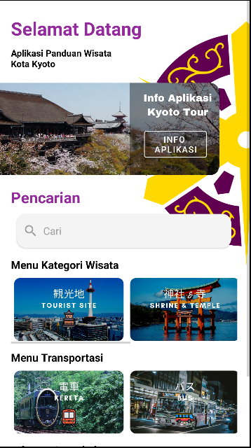
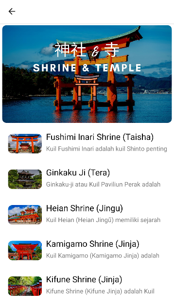
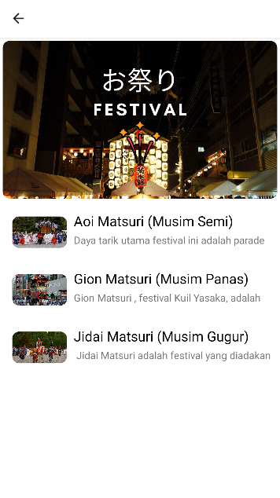
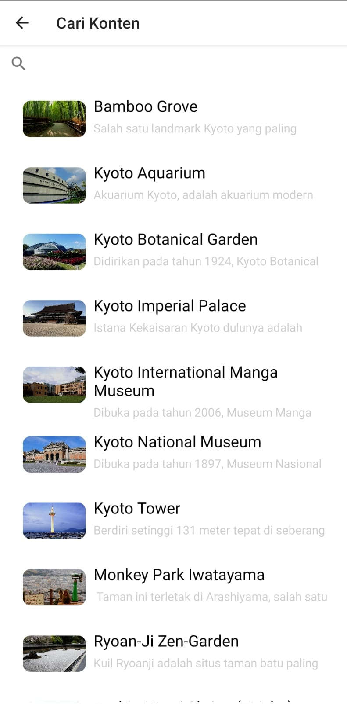
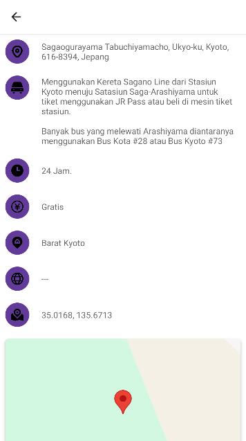
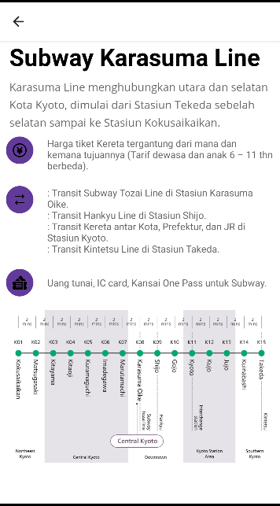

# Kyoto Tour | Aplikasi Panduan Wisata Kota Kyoto

<br />
<p align="center">
  <a href="https://github.com/Pharos911/KyotoTour">
    
  </a>
  <h3 align="center">Kyoto Tour</h3> 
  <p align="center"><b>Aplikasi Panduan Wisata Kota Kyoto Dengan Google Maps API
    </b></p>
</p>
</br>

## Tentang Aplikasi
Kyoto Tour adalah sebuah aplikasi panduan wisata dan kuliner yang berada di Kota Kyoto. Memberikan rekomendasi informasi bantuan bagi para wisatawan yang ingin berkunjung ke Kota Kyoto. Dengan Informasi Transportasi dan penggunaan Goole Maps API untuk menampilkan koordinat lokasi pengguna dengan tempat wisata 

## Gambaran Ummum Aplikasi
<p float="left">
  
  
  
</p></br>
<p float="left">
  
  
  
</p></br>

**Fitur**
* Pengelompokan kategori wisata dan transportasi
* Detail informasi mengenai wisata dan transportasi
* penggunaan [google map](https://www.google.com/maps) pada wisata
* Pencarian dengan masukan teks dari keyboard untuk mencari wisata
* Informasi tambahan
  1. [Informasi Mengenai Prefektur](https://www.youtube.com/watch?v=FBN2YXbwB44) By Visitjapan 
  2. [Informasi mengenai Kota Kyoto](https://youtu.be/2G0Hh8f9Cc8?si=LSlW9xrl8PYCCIuH) By Japan-Guide.com
  3. [Perbedaan Kuil Shinto dan Budha](https://www.youtube.com/watch?v=Ll696KfKjEc&t=568s) By Let's ask Shogo | Your Japanese friend in Kyoto

## Requirements
* Android Studio Bumblebee 2021.1.1
* Minimum [Android SDK 21](https://developer.android.com/tools/releases/platforms#5.1)
* [Google Cloude](https://console.cloud.google.com/apis/library)

## Tools, Library & Frameworks
* [Google Maps API]([https://www.tensorflow.org/](https://console.cloud.google.com/apis/library/maps-android-backend.googleapis.com)
* [Android Studio](https://developer.android.com/studio)
* [Java](https://www.java.com/en/)

## Android Library
* Constraint Layout
* Filter
* GMaps Service
* Gmaps Location
* Material Design
* LatLang
* Glide
* ViewHolder
* VideoView

## Kredit
**Video**
```
https://www.youtube.com/@LetsaskShogo/videos
https://www.youtube.com/@japanguide/videos
https://www.youtube.com/@visitjapan1216/videos
```
